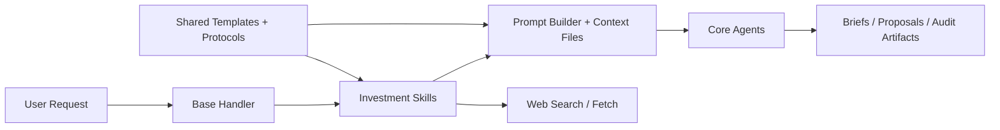

> **Internal/historical document — not user-facing operator documentation. See root `CLAUDE.md` and `setup-guide.md` for current operating guidance.**

# Architecture: Investment Agent v1

## System Overview

## Tech Stack Decisions

| Decision | Choice | Rationale | Alternatives Considered |
|----------|--------|-----------|-------------------------|
| System model | Two RealizeOS systems | Clear personal/company separation | Single combined desk |
| Agent model | Four-agent core team | Lower routing ambiguity | Specialist-heavy team |
| Workflow model | YAML v2 skills | Encodes repeatable operations cleanly | Prompt-only operations |
| Market research | Existing web tools | Already available and tested | New external service in v1 |
| Cross-system review | Shared skill + explicit context files | Targeted access without global bleed | Global `cross_system: true` |

## Data Model

### Entity: Portfolio Policy
| Field | Type | Notes |
|-------|------|-------|
| policy_scope | markdown | Personal or company mandate |
| allocation_rules | markdown | Strategic bands and sleeves |
| review_cadence | markdown | Daily, monthly, quarterly |
| prohibited_actions | markdown | Non-negotiable bans |

### Entity: Authority Matrix
| Field | Type | Notes |
|-------|------|-------|
| current_mode | enum | observe, recommend, paper_execute, live_with_approval, autonomous_capped |
| approval_thresholds | markdown | What requires human approval |
| escalation_rules | markdown | What blocks autonomous action |

### Entity: Risk Rules
| Field | Type | Notes |
|-------|------|-------|
| concentration_limits | markdown | Position and sleeve caps |
| liquidity_rules | markdown | Manual assets and exit assumptions |
| stale_data_policy | markdown | Research freshness rules |
| veto_conditions | markdown | Immediate blockers |

### Entity: Audit Artifact
| Field | Type | Notes |
|-------|------|-------|
| proposal_type | markdown | Brief, rebalance, paper trade, committee memo |
| rule_invoked | markdown | Policy or risk rule |
| sources_used | markdown | Research and file inputs |
| approval_status | markdown | Pending, approved, rejected, overridden |

## API Design

### Endpoints

| Method | Path | Auth | Description |
|--------|------|------|-------------|
| POST | /api/chat | Existing | Main investment-agent interaction path |
| POST | /api/systems/reload | Existing | Pick up new systems and skills |

### Error Handling
- Missing policy files result in blocking guidance inside the relevant workflow.
- Tool failures degrade to sourced manual guidance rather than fabricated data.

## Component Breakdown

### `realize-os.yaml`
- **Responsibility:** Register both investment systems and route their agents.
- **Dependencies:** Auto-discovered markdown agents and YAML skills.
- **Interface:** Existing config loader.

### `realize_core.skills.executor`
- **Responsibility:** Support richer skill inputs such as shared contexts, `query_template`, and reusable tool-result variables.
- **Dependencies:** Prompt builder, web tools, conversation context.
- **Interface:** Existing `execute_skill()` path.

### Investment System KB
- **Responsibility:** Hold policy, authority, risk, accounts, and insight state.
- **Dependencies:** Prompt builder layers and explicit skill context loading.
- **Interface:** Markdown files in FABRIC structure.

## Infrastructure

- **Hosting:** Existing RealizeOS runtime
- **CI/CD:** Existing local test workflow
- **Environments:** Current local/dev environment only for v1
- **Monitoring:** Existing logging plus audit artifacts in KB

## Security

- **Authentication:** Existing API auth model
- **Authorization:** Authority matrix inside each system governs workflow behavior
- **Data Protection:** Separate systems for personal and company records
- **API Security:** No live brokerage actions or new privileged endpoints in v1
