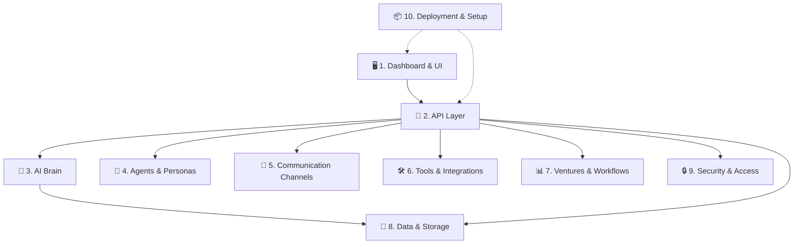

# RealizeOS V5 — Building Blocks Guide

> A non-technical map of every independent "piece" of the system, so you can plan focused improvement sessions.

---

## How to Read This Guide

Each **Building Block** below is a self-contained area of the system. They can be improved **independently** — meaning you can have a focused session on any single block without touching the others.

For each block you'll find:
- **What it does** — plain-English explanation
- **Why you'd improve it** — what "better" looks like
- **Independence level** — how much it can be changed without affecting other blocks
- **Files involved** — where the code lives (for reference)

---

## The 10 Building Blocks

---

### 1. 🖥️ Dashboard & Visual Interface

| | |
|---|---|
| **What it does** | The web-based control panel where you see everything — overview stats, chat, agent status, settings, etc. This is the React app you interact with in your browser. |
| **Independence** | ⭐⭐⭐⭐⭐ **Very High** — UI-only changes (layout, colors, animations, page structure) are completely independent from the backend. |
| **Why improve** | Better visual design, smoother navigation, more intuitive layouts, dark/light mode polish, responsive mobile support. |
| **Key pages** | Overview, Chat, Ventures, Agents, Skills, Tools, Workflows, Pipeline Builder, Settings, Integrations, Activity, Evolution, Routing, Approvals, Setup Wizard |
| **Files** | `dashboard/` (React + Vite + TypeScript) |

**Example session topics:**
- "Redesign the overview dashboard with better charts and cards"
- "Improve the chat interface experience"
- "Make the settings page more organized and user-friendly"
- "Add better visual feedback and animations throughout"

---

### 2. 🔌 API Layer (Backend Gateway)

| | |
|---|---|
| **What it does** | The "traffic controller" that sits between the Dashboard and all the backend systems. When you click something in the UI, it sends a request to the API, which routes it to the right system. |
| **Independence** | ⭐⭐⭐ **Medium** — API changes often need matching updates in both the Dashboard (frontend) and the Core system (backend). |
| **Why improve** | Better error messages, faster responses, more consistent data formatting, better input validation. |
| **Files** | `realize_api/` — 20 route files covering chat, agents, auth, settings, ventures, etc. |

**Example session topics:**
- "Improve API error handling and user-friendly error messages"
- "Optimize API response times for the dashboard"
- "Add better input validation across all endpoints"

---

### 3. 🧠 AI Brain (LLM Engine)

| | |
|---|---|
| **What it does** | The intelligence layer — decides which AI model to use (Claude, Gemini, etc.), routes requests to the best model for the task, builds prompts, and manages AI provider connections. |
| **Independence** | ⭐⭐⭐⭐ **High** — The AI routing and prompt logic can be improved without touching the UI or other systems. |
| **Why improve** | Smarter model selection, better prompt templates, cost optimization, faster responses, support for more AI models. |
| **Sub-components** | LLM Router, Prompt Builder (brand/goal/brief templates), Model Registry, Provider Clients (Claude, Gemini, LiteLLM), Benchmark Cache |
| **Files** | `realize_core/llm/`, `realize_core/prompt/` |

**Example session topics:**
- "Optimize the model routing to pick the best AI for each task type"
- "Improve prompt templates for better output quality"
- "Add cost-tracking and budget controls for AI usage"
- "Fine-tune the model benchmarking system"

---

### 4. 🤖 Agents & Personas

| | |
|---|---|
| **What it does** | The AI "team members" — each agent has a persona (personality/role), can be activated/deactivated, follows guardrails, and can hand off tasks to other agents. |
| **Independence** | ⭐⭐⭐⭐ **High** — Agent behavior, personas, and guardrails can be tuned independently. |
| **Why improve** | More nuanced agent personas, smarter task handoffs between agents, better guardrails, more reliable activation/deactivation. |
| **Sub-components** | Agent Registry, Personas, Guardrails, Handoff Logic, Activation Engine, Agent Pipeline |
| **Files** | `realize_core/agents/` |

**Example session topics:**
- "Create better-defined agent personas for specific business use cases"
- "Improve agent-to-agent handoff logic"
- "Strengthen guardrails to prevent unwanted AI behaviors"
- "Optimize the agent activation system"

---

### 5. 💬 Communication Channels

| | |
|---|---|
| **What it does** | How the system communicates with the outside world — via WhatsApp, Telegram, web chat, webhooks, and scheduled messages. Each channel is a separate adapter. |
| **Independence** | ⭐⭐⭐⭐⭐ **Very High** — Each channel (WhatsApp, Telegram, etc.) is fully independent and can be improved or added without affecting others. |
| **Why improve** | Better message formatting per channel, faster delivery, richer media support, new channel integrations (Slack, Discord, email, SMS). |
| **Sub-components** | WhatsApp Adapter, Telegram Adapter, Web Chat, Webhooks, Scheduler (timed messages) |
| **Files** | `realize_core/channels/`, `plugins/channels/` |

**Example session topics:**
- "Improve WhatsApp message handling and formatting"
- "Add a new Slack or Discord channel"
- "Better file/media sharing across channels"
- "Optimize webhook reliability"

---

### 6. 🛠️ Tools & Integrations

| | |
|---|---|
| **What it does** | External services the AI can use — Google Workspace (Docs, Sheets, Calendar), Stripe payments, social media posting, web browsing, document generation, voice/telephony, and more. |
| **Independence** | ⭐⭐⭐⭐⭐ **Very High** — Each tool is fully self-contained. You can add, remove, or improve any single tool without affecting anything else. |
| **Why improve** | More reliable integrations, new tools (CRM, project management, accounting), better approval flows for sensitive actions. |
| **20+ tools** | Google Workspace, Google Sheets, Stripe, Browser, MCP, Messaging, Social Media, Voice, Telephony, Document Generator, Web Tools, PM Tools, and more |
| **Files** | `realize_core/tools/` |

**Example session topics:**
- "Improve the Google Workspace integration reliability"
- "Add a CRM tool (HubSpot, Salesforce)"
- "Make the Stripe payment tools more user-friendly"
- "Develop better approval flows for high-impact tool actions"

---

### 7. 📊 Ventures, Workflows & Pipelines

| | |
|---|---|
| **What it does** | The business-management layer — Ventures are your business projects, Workflows are automated sequences of steps, and Pipelines are visual process builders. The systems also include pre-built templates for different business types (consulting, e-commerce, SaaS, etc.). |
| **Independence** | ⭐⭐⭐⭐ **High** — Workflow logic and venture management are self-contained. Templates can be added/edited freely. |
| **Why improve** | Better workflow automation, more pipeline templates, smarter venture analytics, easier venture creation. |
| **Sub-components** | Venture Manager, Workflow Engine, Pipeline Builder, Business Templates (8 types), Goal Templates, Persona Templates |
| **Files** | `realize_core/workflows/`, `realize_core/pipeline/`, `ventures/`, `systems/`, `templates/` |

**Example session topics:**
- "Create new business templates (real estate, healthcare, etc.)"
- "Improve the workflow automation engine"
- "Make the pipeline builder more powerful and intuitive"
- "Better venture health monitoring and analytics"

---

### 8. 💾 Data, Memory & Knowledge

| | |
|---|---|
| **What it does** | Everything about data persistence — the database (SQLite), file storage (local or S3 cloud), the Knowledge Base (searchable document index), conversation memory, and user preference learning. |
| **Independence** | ⭐⭐⭐ **Medium** — Storage and memory improvements are internal, but database schema changes can ripple. Knowledge Base indexing is highly independent. |
| **Why improve** | Faster search, better knowledge retrieval, smarter memory consolidation, more storage options, improved preference learning. |
| **Sub-components** | Database & Migrations, Local Storage, S3 Storage, Storage Sync, Knowledge Base Indexer, Conversation Memory, Memory Consolidator, Preference Learner |
| **Files** | `realize_core/db/`, `realize_core/storage/`, `realize_core/kb/`, `realize_core/memory/`, `realize_core/ingestion/` |

**Example session topics:**
- "Improve the knowledge base search accuracy"
- "Optimize memory consolidation for better context recall"
- "Set up cloud storage (S3) synchronization"
- "Better learning from user preferences over time"

---

### 9. 🔒 Security & Access Control

| | |
|---|---|
| **What it does** | Protects the system — JWT authentication (login tokens), role-based access control (who can do what), prompt injection detection (blocking AI attacks), input sanitization, and audit logging. |
| **Independence** | ⭐⭐⭐⭐ **High** — Security features are layered on top and can be strengthened independently. |
| **Why improve** | Stronger authentication, more granular permissions, better attack detection, compliance audit trails, multi-user support. |
| **Sub-components** | JWT Authentication, RBAC (Role-Based Access), Prompt Injection Detection, Input Sanitizer, Security Scanner, Audit Logger, API Middleware |
| **Files** | `realize_core/security/`, `realize_api/security_middleware.py` |

**Example session topics:**
- "Strengthen authentication and add multi-factor support"
- "Set up role-based access for team members"
- "Improve prompt injection detection"
- "Better audit logging and compliance reports"

---

### 10. 📦 Deployment, Setup & DevOps

| | |
|---|---|
| **What it does** | Everything needed to install, update, and run the system — installation scripts, Docker containers, the setup wizard, migration tools, update scripts, and the CLI. |
| **Independence** | ⭐⭐⭐⭐ **High** — Deployment scripts and setup flows are independent from the core application logic. |
| **Why improve** | Easier installation, smoother updates, better migration from older versions, more reliable Docker deployment, improved CLI experience. |
| **Sub-components** | Install Script, Uninstall Script, Update Script, Migration Script, Docker Setup, Setup Wizard, CLI, Deploy Script, Lite Version |
| **Files** | `Install-RealizeOS.bat`, `Update-RealizeOS.bat`, `Uninstall-RealizeOS.bat`, `Migrate-RealizeOS.bat`, `Dockerfile`, `docker-compose.yml`, `cli.py`, `realize_core/setup_wizard.py`, `realize_lite/` |

**Example session topics:**
- "Simplify the installation process"
- "Make the update process more reliable"
- "Improve Docker deployment configuration"
- "Better CLI commands and help system"

---

## 🔗 Bonus: Cross-Cutting Systems

These are smaller subsystems that span across multiple blocks. They can still be improved independently:

| System | What it does | Files |
|---|---|---|
| **Evolution Engine** | Self-improvement — the system analyzes its own performance, detects gaps, refines prompts, suggests new skills | `realize_core/evolution/` |
| **Optimizer** | Runs A/B experiments to find the best model settings, prompts, and parameters | `realize_core/optimizer/` |
| **Governance** | Trust levels and approval gates — controls what the AI can do autonomously vs. what needs human approval | `realize_core/governance/` |
| **Scheduler** | Timed tasks — heartbeats, lifecycle management, scheduled reports | `realize_core/scheduler/` |
| **Activity & Logging** | Tracks everything that happens — event bus, activity store, logger | `realize_core/activity/` |
| **Eval Suite** | Quality testing — automated test harnesses to evaluate AI output quality | `realize_core/eval/` |
| **Dev Mode** | Developer tooling — health checks, git safety, scaffolding for new features | `realize_core/devmode/` |
| **Extensions & Plugins** | Plugin system — allows adding new functionality via hooks, cron jobs, and a plugin registry | `realize_core/extensions/`, `realize_core/plugins/` |

---

## 📋 Recommended Session Planning Order

Here is a suggested prioritization based on **user impact** and **independence** (easiest to improve first):

| Priority | Building Block | Reason |
|---|---|---|
| 1️⃣ | **Dashboard & UI** | Highest visual impact, fully independent, easiest to iterate on |
| 2️⃣ | **Tools & Integrations** | Each tool is self-contained; adding one new tool = immediate value |
| 3️⃣ | **Communication Channels** | Each channel is independent; quick wins |
| 4️⃣ | **Agents & Personas** | High impact on AI behavior quality, independent tuning |
| 5️⃣ | **AI Brain** | Core intelligence improvements, contained in its own layer |
| 6️⃣ | **Ventures & Workflows** | Business template expansion, workflow automation |
| 7️⃣ | **Security & Access** | Important for production readiness |
| 8️⃣ | **Deployment & Setup** | Already recently upgraded; polish remaining gaps |
| 9️⃣ | **Data & Memory** | Deeper technical lift; medium independence |
| 🔟 | **Evolution & Optimization** | Advanced self-improvement features |

---

> **How to use this:** Pick any building block, start a new session, and say: *"I want to optimize [Building Block Name]"*. We'll dive into that specific area without worrying about the rest of the system.
